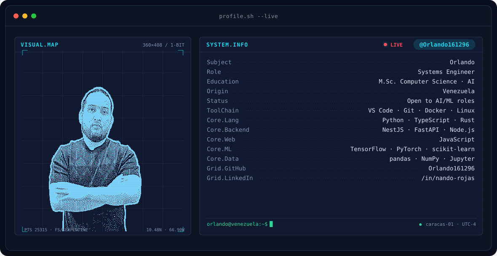
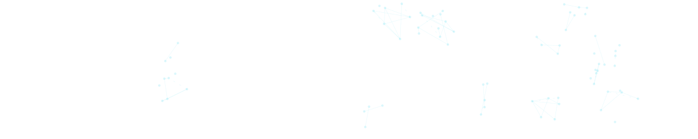

 

 

&nbsp;&nbsp;

## About me

Systems Engineer with an **M.Sc. in Computer Science (Artificial Intelligence)**. I build backend services with **Python, TypeScript and Rust** — currently NestJS and FastAPI — with a focus on machine learning and AI. Based in Venezuela, working at [Cecosesola](https://cecosesola.org). Open to AI/ML roles.

## Tech stack

  

## Signals

  
  

## GitHub stats

  

